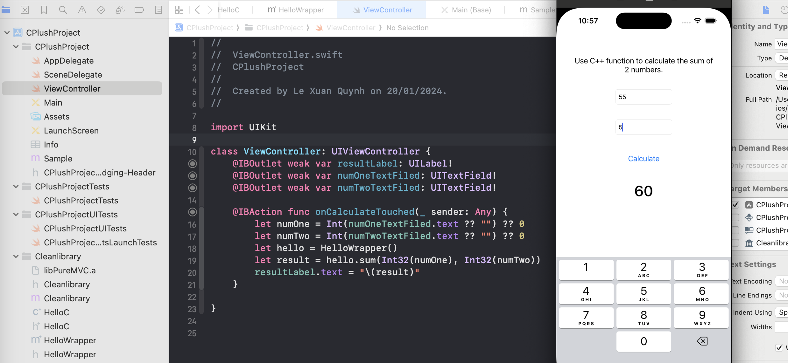

# Using C++ in Swift
The demo project for using C++ in Swift.
Image demo:

## The steps to create this project
1. Create a new project in Xcode, choose Single View App.
2. Make a library project in Xcode, choose Objective-C Library, with name "Cleanlibrary".
3. Add a header file C++ file in the library project, with name "HelloC.hpp".
4. Add a source file C++ file in the library project, with name "HelloC.cpp".
5. Add a sum function in the "HelloC.cpp" file.
```cpp
int sum(int a, int b);
```
6. Add the Objective-C file for wrapping the C++ function, with name "HelloCWrapper.mm":
```objc
@implementation HelloWrapper

- (void)hello {
    helloCObj.hello();
}

// for sum function
- (int)sum:(int)a :(int)b {
    return helloCObj.sum(a, b);
}
```

7. Add the header file for wrapping the C++ function, with name "HelloCWrapper.h".

8. Add a bridging header file in the Swift project, with name "CPlushProject-Bridging-Header.h".
Tips: You can add automatically by Xcode, just add a C++ file in the Swift project, Xcode will ask you to add the bridging header file.
9. In the bridging header file, add the header file of the Objective-C library project.
```objc
#import <Cleanlibrary/Cleanlibrary.h>
#import <Cleanlibrary/HelloWrapper.h>
```

10. In the Swift file, using the C++ function like this:
```swift
    let numOne = Int(numOneTextFiled.text ?? "") ?? 0
    let numTwo = Int(numTwoTextFiled.text ?? "") ?? 0
    let hello = HelloWrapper()
    let result = hello.sum(Int32(numOne), Int32(numTwo))
    resultLabel.text = "\(result)"
```

## License
This project is licensed under the MIT License - see the [LICENSE](LICENSE) file for details.

## CopyRight
This project is created by [Codetoanbug](https://codetoanbug.com) - a blog for sharing coding knowledge.